.. _mathematica:

Mathematica
==============

.. raw:: html

    

.. role:: red

The :code:`Mathematica` implementation differs from the other tools as the user does not need to copy-past the tensor into the `.cpp` files (although we plan to also implement similar functionalities in the future).

We provide two example scripts on the :code:`tools/ModelGeneration` folder, :code:`R2HDM.m` and :code:`N2HDM.m`. We will take a closer look at the latter implementation script, the :code:`N2HDM`, and go through it step by step.

Fields
------------------------------------------------------------------------------------------------------------------------

The first step is to define all the scalar fields of the model. Parameters in :red:`red` do not need to be changed.

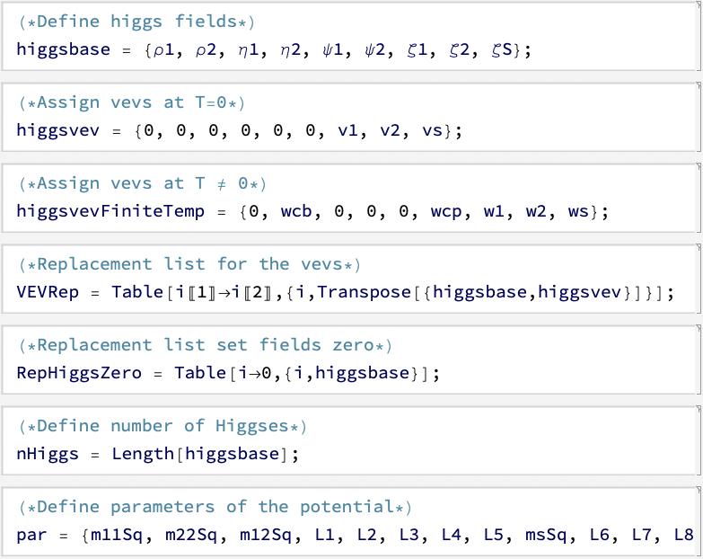

- **higgsbase** - Fields in the gauge basis.
- **higgsvev** - VEVs at :math:`T = 0`.
- **higgsvevFiniteTemp** - All fields that can acquire a VEV. Usually gauge group transformations can be used to transform from the **higgsbase** into a VEV space with less dimensionality, which is better for computational methods.
- :red:`VEVRep` - Transforms from the complete gauge basis into the :math:`T=0` VEV.
- :red:`RepHiggsZero` - Sets all VEVs to zero.
- :red:`NHiggs` - Number of scalar particles.
- **par** - List of all potential parameters (dependent and independent).

Tree-level Potential
------------------------------------------------------------------------------------------------------------------------

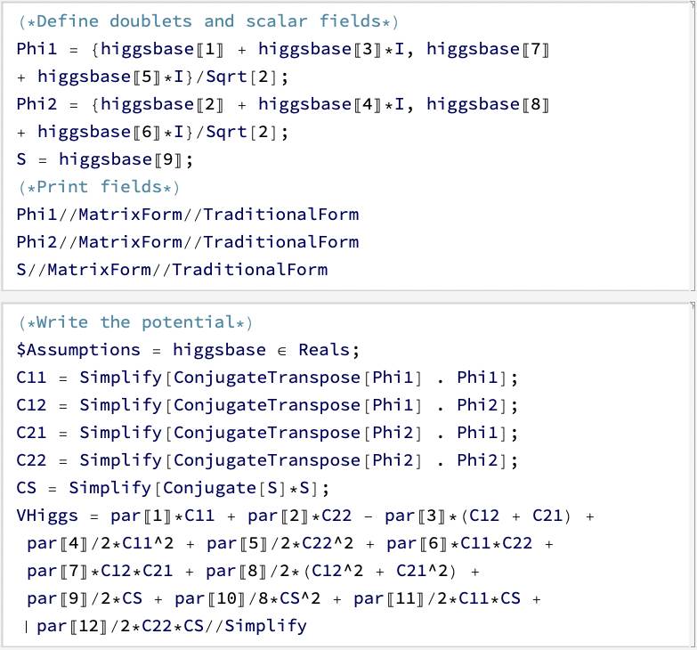

We now construct the potential using the fields **higgsbase** and parameters **par**. **Phi1**, **Phi2** and **S** are the doublets and real scalar field, respectivelly. 

**C11**, **C12**, **C21**, **C22** and **CS** are gauge invariant quadratic field components used to defined the tree-level potential **VHiggs**.

Minimization conditions
------------------------------------------------------------------------------------------------------------------------

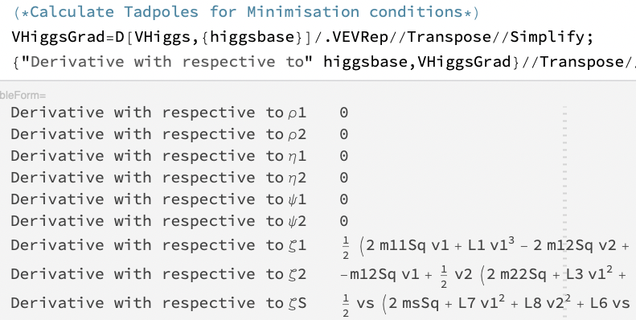

We automatically compute a check to see if **higgsvev** is a stationary point at :math:`T=0`. For this specific case we see that 3 derivatives do not vanish so some potential parameters have to be fixed. This is done further down.

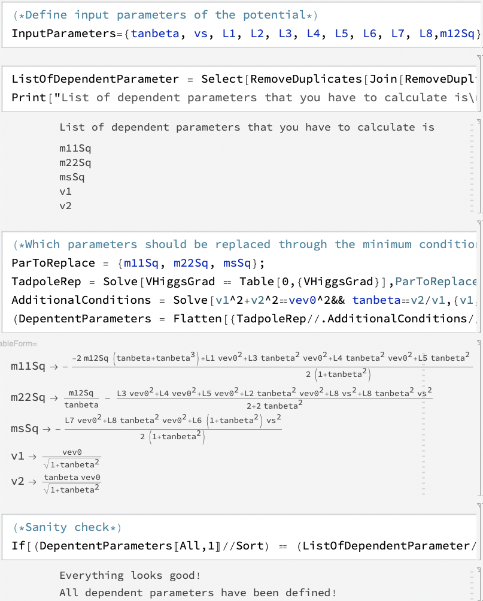
    
We define the **InputParameters**, these can either be **higgsvev**, **pars** or masses, and are the parameters whose numerical value taken as input.

On :red:`ListOfDependentParameters` we show the **higgsvev** and **pars** that have to be determined from the **InputParameters**, this check is done automatically and we see that we have to determine 5 parameters.

On **ParToReplace** we chose which potential parameters are considered dependent and can be solved for, we chose :code:`m11Sq`, :code:`m22Sq` and :code:`msSq`. Furthermore, we added two conditions :code:`v1^2 + v2^2 = vev0` and :code:`tanbeta=v2/v1` to determine the other two parameters. :code:`vev0` = 246.22 GeV (hard coded into BSMPT) and :code:`tanbeta` is an input parameter.

After this, we perform one more check to check that all dependent parameters can be calculated as functions of the input parameters.

Higgs Curvatures
------------------------------------------------------------------------------------------------------------------------

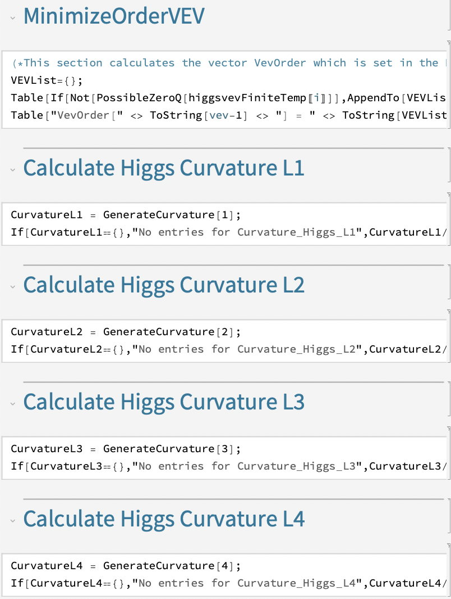

This part of the code does not need to be changed at all.

**VEVList** stores the positions of the VEVs that can be non-zero, this improves the computational speed.

**CurvatureL1**, **CurvatureL2**, **CurvatureL3**, **CurvatureL4** store the coefficients of the operators.

Counterterm Potential
------------------------------------------------------------------------------------------------------------------------

Next we move into the counter term potential. It is generated from the tree level potential where all parameters are promoted into *counter term* parameters, and we also add counter terms linear on the fields, denoted as :math:`\delta T_i`. This should be done automatically without any input from the user.

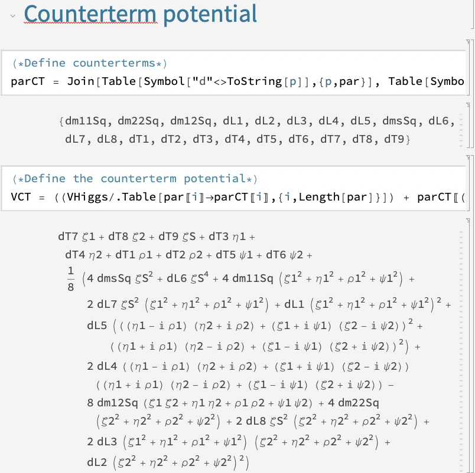

Next we have to determine the counter terms such that the renormalization conditions

.. math::
 \begin{aligned}\left\langle \frac{\partial V_{\rm ct}}{\partial h_i}\right\rangle = \left\langle-\frac{\partial  V^{(1)}_{\rm CW}}{\partial h_i}\right\rangle\,, & & \left\langle \frac{\partial^2 V_{\rm ct}}{\partial h_i\partial h_j}\right\rangle = \left\langle- \frac{\partial^2  V^{(1)}_{\rm CW}}{\partial h_i\partial h_j}\right\rangle\,.\end{aligned}

are fulfilled. This is done by this code

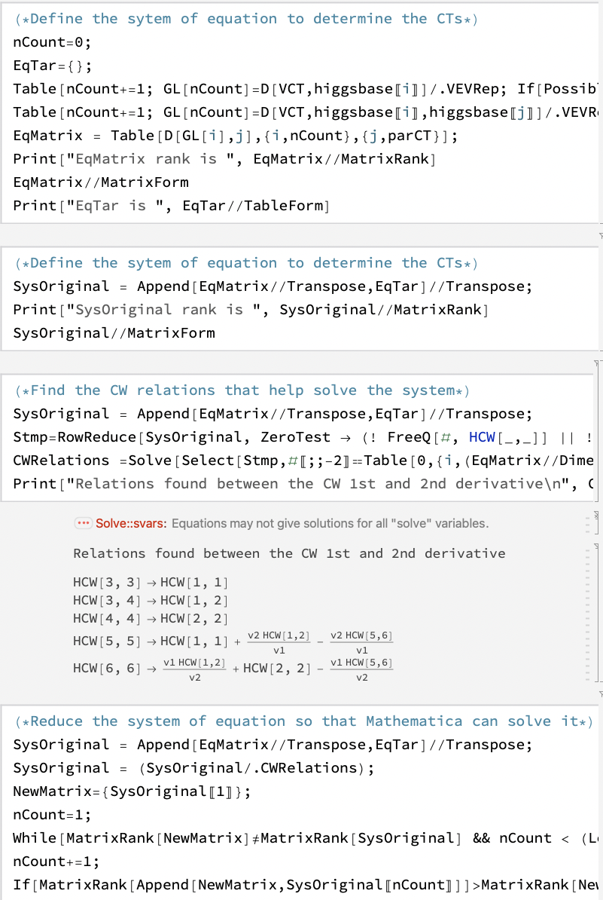

and should work out of the box. If any problem occurs then some troubleshooting is necessary to solve the system of equations.

In the end we have this solution for the :code:`N2HDM`

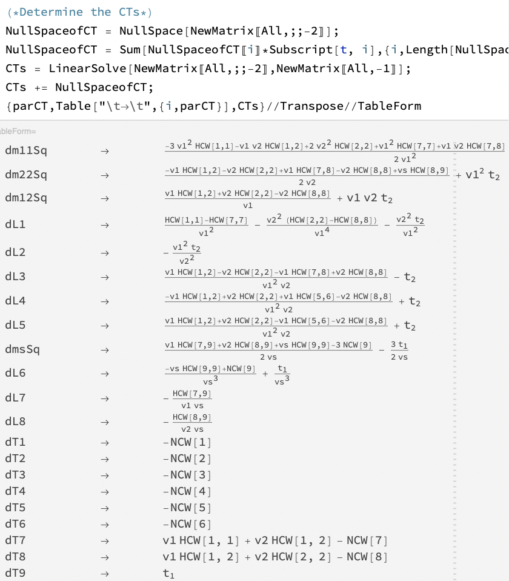

where you can notice the existence of :math:`t_1` and :math:`t_2`. This come up from the fact that we have more counter terms than conditions and the system is undertermined, so they are completly free.

To match the results from the article mentioned at the start, we set

.. math::
 \delta L_4 = 0 \quad \text{and} \quad \delta T_9 = 0

that is done here

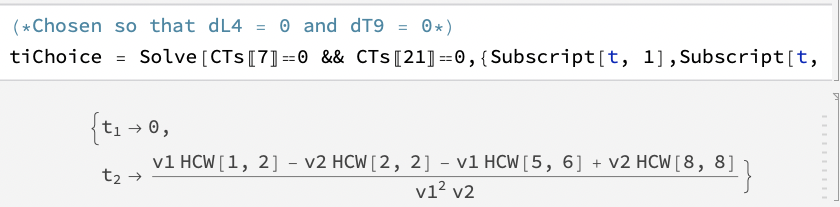

After that, we perform a check to see if everything is consistent and convert the counter terms into :code:`cpp` syntax.

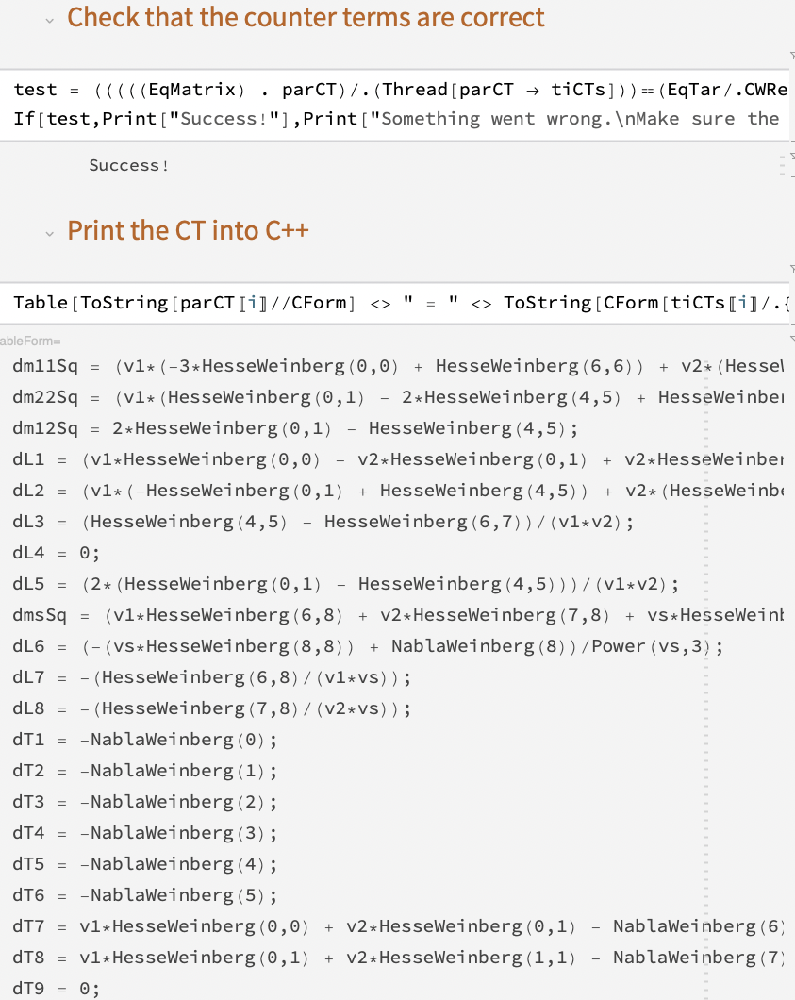

Finally, we calculate the tensors of the counter term potential. No action is needed by the user.

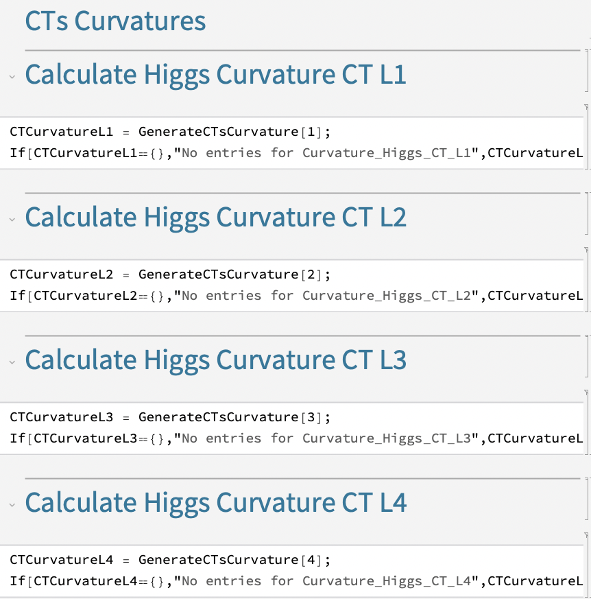

Gauge Potential
------------------------------------------------------------------------------------------------------------------------

Next, we move on to the gauge sector.

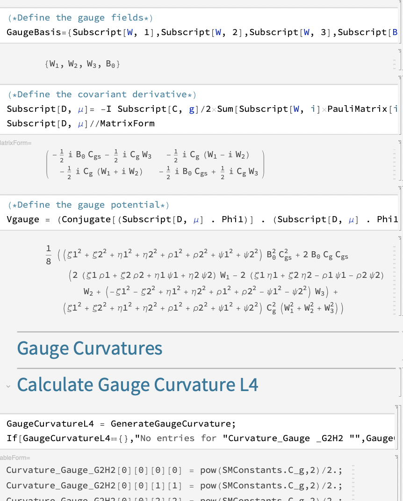

On the first cell, we defined the gauge fields. On the second, we define the covariant derivatives of the gauge fields and, on the third, we define the gauge potential.

After all this, we determine the scalar tensors of the gauge potential.

Leptonic Potential
------------------------------------------------------------------------------------------------------------------------

The leptonic contributions to the effective potential are made here

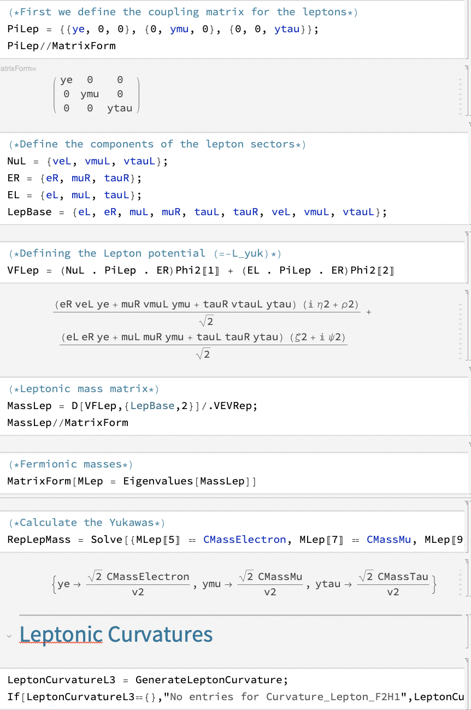

where in the first cell we define the (diagonal) lepton yukawa matrix, on the second we define the left and right Weyl spinors of the leptons and, on the third, we define the Yukawa potential. Then we determine the mass matrix and and calculate the eigenvalues (masses). 

On the seventh, the user has to identify where the masses of the different leptons are.

Finally, we calculate the curvature tensors for the leptons. Unless you have a different leptonic sector, there is no need to change this section.

Quark Potential
------------------------------------------------------------------------------------------------------------------------

The quark sector is implemented in a very similar way to the lepton sector. 

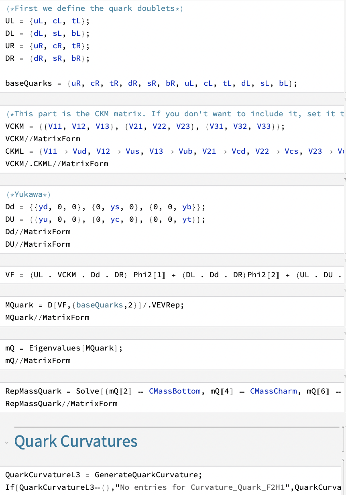

We start by defined the Weyl spinors, the CKM matrix, the Yukawa quark matrix and the quark Yukawa potential.

Then we calculate the quark mass matrix and its eigenvalues (masses). On the seventh cell, we identify the position of the quark masses on the vectors of eigenvalues (similar to the leptons).

On the last cell, we compute the quark curvature tensors.

Model implementation
------------------------------------------------------------------------------------------------------------------------

Now it is time to implement the model into :code:`BSMPT`. This is done on the last cell of the notebook.

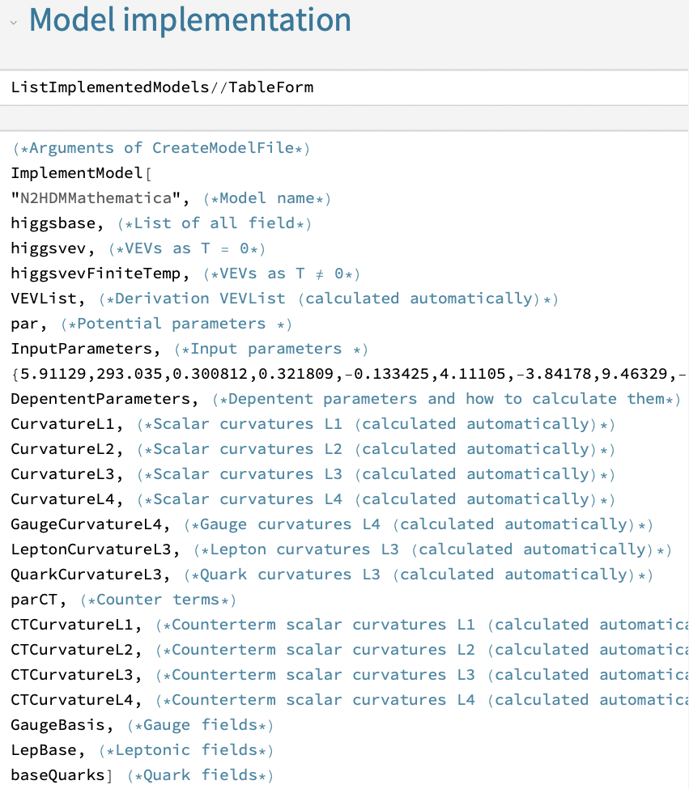

If all was done correctly, there are only two things to change at this stage. The first is the model name, which in the image is set to :code:`"N2HDMMathematica"` (you can see the list of currently implemented models by running the first cell). The second thing to change is the list of numbers following *InputParameters* : :code:`{5.91129, 293.035, ...}`, this list is used to create an example file of your model. The list must have a set of parameters that match the **InputParameters**, e.g. :code:`5.91129 = tanbeta`, :code:`vs = 293.035` and so on.

This final output should read something like this

.. code-block::
    
 Inserting model name into CMakeList
 Model is already in CMakeList.txt
 Inserting model name into IncludeAllModels.h
 Model is already in IncludeAllModels.h
 Inserting model name into IncludeAllModels.cpp
 Model is already in IncludeAllModels.h
 Creating model header
 Creating model implementation .cpp
 Created example point in BSMPT/example
 To run example point 
 /Users/.../BSMPT/build/macos-armv8-release/bin/Test --model=N2HDMMathematica --input=/Users/joaofranciscoviana/mega/BSMPT/example/N2HDMMathematica_Input.tsv --line=2
 Remember to recompile!

if all went well. On the last line we provide a command to check if everything went well, just remember to **build BSMPT again!**.

.. code:: text

 (base) user@computer BSMPT % /Users/.../BSMPT/build/macos-armv8-release/bin/Test --model=N2HDMMathematica --input=/Users/joaofranciscoviana/mega/BSMPT/example/N2HDMMathematica_Input.tsv --line=2                                           
 Model = n2hdmmathematica

 The input parameters are : 
 tanbeta = 5.9112900000000002
 vs = 293.03500000000003
 L1 = 0.30081200000000002
 L2 = 0.32180900000000001
 L3 = -0.13342499999999999
 L4 = 4.1110499999999996
 L5 = -3.84178
 L6 = 9.4632900000000006
 L7 = -0.75045499999999998
 L8 = 0.74398200000000003
 m12Sq = 4842.2799999999997

 The parameters are : 
 m11Sq = 56587.860409831024
 m22Sq = -40721.391798323843
 m12Sq = 4842.2799999999997
 L1 = 0.30081200000000002
 L2 = 0.32180900000000001
 L3 = -0.13342499999999999
 L4 = 4.1110499999999996
 L5 = -3.84178
 msSq = -427595.36752363807
 L6 = 9.4632900000000006
 L7 = -0.75045499999999998
 L8 = 0.74398200000000003

 The counterterm parameters are : 
 dm11Sq = -20576.516748182021
 dm22Sq = 7591.144019621177
 dm12Sq = -3750.152966072023
 dL1 = 13.135265450640942
 dL2 = -0.30118068372454221
 dL3 = 0.090593168046231895
 dL4 = 0
 dL5 = -0.7584176691883282
 dmsSq = 171893.99198022886
 dL6 = -6.6217341780605103
 dL7 = 0.15708706243439083
 dL8 = -0.16609806282484066
 dT1 = -0
 dT2 = -0
 dT3 = -0
 dT4 = -0
 dT5 = -0
 dT6 = -0
 dT7 = 1.9153958419337869e-09
 dT8 = 5.1222741603851318e-09
 dT9 = 0

 The scale is given by mu = 246.21965079413735 GeV 

 The tested Model is the n2hdmmathematica
 This function calculates the masses of the gauge bosons, fermions and Higgs boson and compares them with the parameters defined in SMparam.h.

 TEST | Pass/Fail
 ================================

 CT number/label match                                                 | Pass
 VEV number/label match                                                | Pass
 addLegendTemp number/label match                                      | Pass
 addLegendTripleCouplings number/label match                           | Pass
 CKM matrix unitarity                                                  | Pass
 Matching gauge boson masses with SMparam.h                            | Pass
 Matching lepton masses with SMparam.h                                 | Pass
 Matching quark masses with SMparam.h                                  | Pass
 Correct EW Minimum                                                    | Pass
 Tadpole relations fullfilled                                          | Pass
 Matching Masses between NLO and tree-level                            | Pass
 Checking second derivative of CW+CT                                   | Pass
 Checking first derivative of CW+CT                                    | Pass
 Check symmetric properties of the scalar tensor Lij                   | Pass
 Check symmetric properties of the scalar tensor Lijk                  | Pass
 Check symmetric properties of the scalar tensor Lijkl                 | Pass
 Check symmetric properties of the gauge tensor in the C2HDM           | Pass
 Check symmetric properties of the Lepton tensor in the C2HDM          | Pass
 Check symmetric properties of the mass Lepton tensor in the C2HDM     | Pass
 Check symmetric properties of the Quark tensor in the C2HDM           | Pass
 Check symmetric properties of the mass Quark tensor in the C2HDM      | Pass
 21 tests out of 21 passed.

 You're good to go!

-----

If any issue is encountered, do not hesitate to open an issue on our Github repository https://github.com/phbasler/BSMPT/issues or to send us an email at bsmpt@lists.kit.edu. 